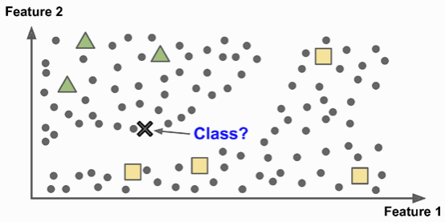

# Active learning
Q. What is the workflow for *active learning* in ML?
A. 1) Train model, 2) Identify most informative unlabelled examples, 3) Obtain “true” values for those examples, 4) Retrain model

Q. What is the advantage of *active learning* in ML?
A. Minimises needed training examples 

<!-- #anki/deck/ML -->

<!-- {BearID:0820BCEB-F9C3-4B46-84A5-8368406FC598-13135-0000173A1729BF47} -->
