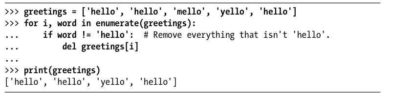

# Al Sweigart: Beyond the Basics
Can help me dramatically increase my Python proficiency – lots of small, nice tips, and also a basic introduction to [[Object-oriented programming (OOP)]].

[file:9F316F9C-FAB1-47DA-9C70-FBBAB8F603EB-91685-000003A2323C9D57/Al Sweigart - Beyond the Basic Stuff with Python. Best Practices.-No Starch Press (2021).pdf]

Q. Why is this an antipattern?

A. Deleting elements from the list shifts the indeces of the following items.

Q. How much memory do you save by avoiding duplicating a list in python?
A. Extremely little! Lists contain references to the objects, not the objects themselves.

Q. 
```
> spam = [1, 2, 3]
> cheese = spam
> spam[2] = 99
```
What are the contents of cheese?
A. `[1, 2, 99]`


<!-- #readable -->

<!-- {BearID:998F1D9D-C0D9-4164-AE82-52E2A0E49577-91685-000003A3336FE682} -->
