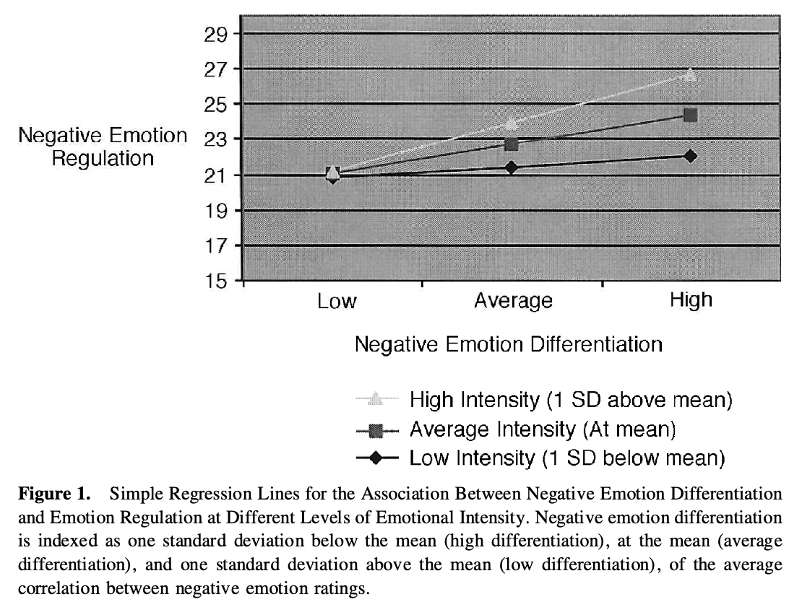

# Barrett 2010
Assesses emotional regulation, then measures whether it is associated to self-reported emotion regulation.

https://www.tandfonline.com/doi/abs/10.1080/02699930143000239

## Backlinks
* [[Emotional Differentiation is useful]]
	* [[Barrett 2010]]

<!-- {BearID:B72964A5-C459-489C-96B5-362566F9C60B-22720-000005350F9C1862} -->
