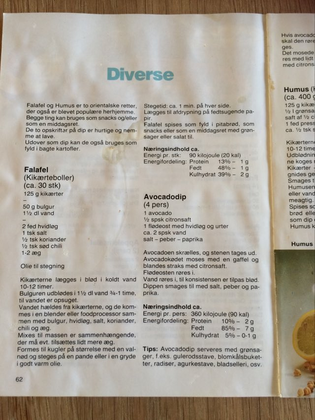

# Christmas, 21
### Gaver
Maja - mangler ønsker
Mor/far - mangler ønsker
Kathrine - mangler at købe og pakke ind

### Mad
* Figure out what to eat! Making something delicious is probably a good move here, because it makes vegetarianism more appealing to the others.

	* Høre far om han vil have noget med?

* Falafler?

* En lidt større ret?
	* Vegetarisk lasagne?

* Google “vegetariske retter”

## Backlinks
* [[Dec-21 - Home]]
	* [[Christmas, 21]]

<!-- #project/home -->

<!-- {BearID:CFBA838E-6A0F-4289-B553-5B5EB1E65531-32465-00000111DE64A84E} -->
