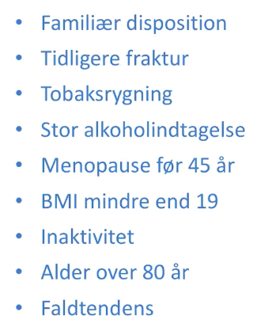

# DEXA

## Backlinks
* [[Osteoporose]]
	* 
	* QG. En 80-årig kvinde har haft en radius-fraktur. Hvad nu?
	* QG. Din patient er opstart i 7,5 mg prednison for [[Polymyalgia rheumatica]]. Hvad nu?
* [[Toxisk multinodøs struma]]
	* QS. Din patient får diagnosticeres [[Toxisk multinodøs struma]]. Hvad vil du tilføje til paraklinik?
* [[Prednisolon]]
	* QG. En 55-årig kvinde opstartes i 5 mg. [[Prednisolon]] p.o. dgl. Hvad bør gøres?
	* QS. En 55-årig kvinde opstartes i 5 mg. [[Prednisolon]] p.o. dgl. i måneder. Henvises til [[DEXA]], T-score = -1.3. Hvad bør gøres?

<!-- {BearID:B8390DF0-9D2C-4B41-85A3-126CD0E8597B-83502-00005DB7FEF52982} -->
