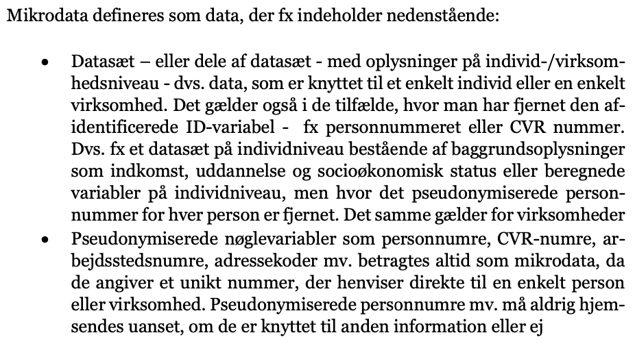

# Dec 2021: DSTs datasikkerhed
Datasikkerhed

Datafortrolighed - data må ikke være individdata eller personhenførbare.

> Som hovedregel må der kun hjemsendes analyseresultater, aggregerede tabeller eller figurer, hvor det ikke er muligt at identificere enkelte enheder, dvs. hverken personer, husstande, familier, virksomheder og andre enheder med afidentifice- rede løbenummer.

*Mikrodata* må aldrig hjemsendes. 

Som tommelfingerregel for at opnå anonymitet:
> Tabeller skal indeholde mindst 3 observationer pr. celle

> Det er under mikrodataordningerne tilladt at hjemsende værdier, der beskriver en fordeling, som max, min og median, der ofte henviser til enkeltindivider. Men det er en forudsætning for at hjemsende disse nøgletal, at der ikke er fare for identifikation af enkeltindivider.

Scatterplots er tilladte, så længe anonymisering er sikret. Dvs. at en ekstrem værdi må ikke kunne identificere et individ. En måde gå omkrign det på er, at man kantage gennemsnittet af 5 værdier der er nær hinanden, hvis det giver mening.

[file:9347D59A-F57B-4E4D-B993-1FCE11FAF455-88388-0000071BB744222E/Hjemsendelse-af-analyseresultater-og-sanktioner-ved-databrud.pdf]

## Backlinks
* [[03-Jan-22 - Service]]
	* [[DSTs opdaterede datasikkerhed]]
* [[04-Jan-22 - Service]]
	* [[DSTs opdaterede datasikkerhed]]

<!-- {BearID:B03E548C-E33E-4637-BD1B-73713424089F-93975-00000604B8F17A1E} -->
