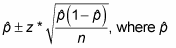

# For subchapter
Her har jeg, hvor stor en proportion af alle kontakter i et tidsinterval der ligger i kapitlet. 

Hvis proportionerne vil være normalfordelte gælder  .

Kan vi antage det? Med en vis rimelighed, ja, det er nok en additive process af tilfældige parametre.

Det er de nok ikke, though. Der vil være ekstremt mange tæt på 1. Hvilken distribution kan jeg så bruge?

## Backlinks
* [[17/11/2021 - Work]]
	* [[For subchapter]]

<!-- {BearID:8A04B7CC-E7F5-4D6C-A202-897F566A886C-25545-000003DCF24D6A79} -->
