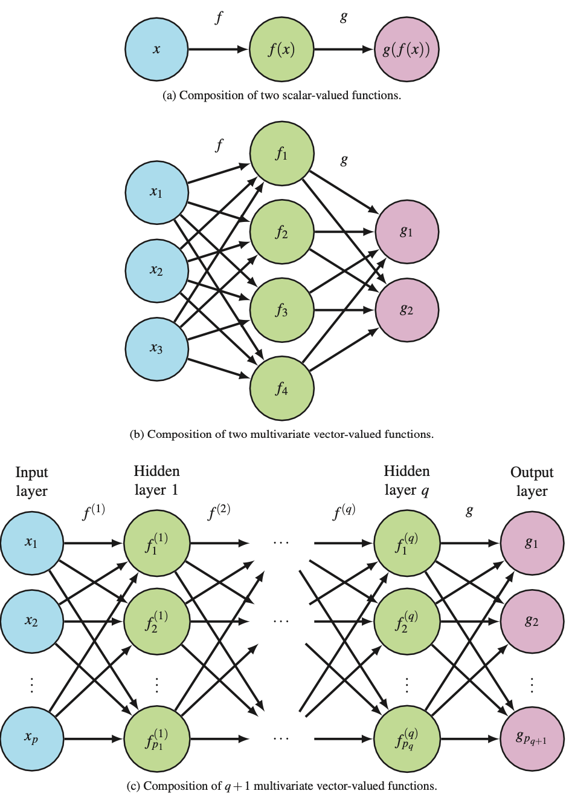
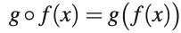
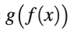
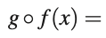

# Function composition

Q. What is this notation called?

A. Function composition

Q. 
?
A. 

Q. How do we rewrite 
 
using [[Function composition]] notation is?
A. 

## Backlinks
* [[Function composition]]
	* Q. How do we rewrite 
using [[Function composition]] notation is?
A. 
* [[Neural networks]]
	* Mathematically, it's known via [[Function composition]].

<!-- #anki/deck/ML -->

<!-- {BearID:C4029013-E6BF-4FC1-8B09-2646F6A4E34E-43256-00000183E4CC2F39} -->
