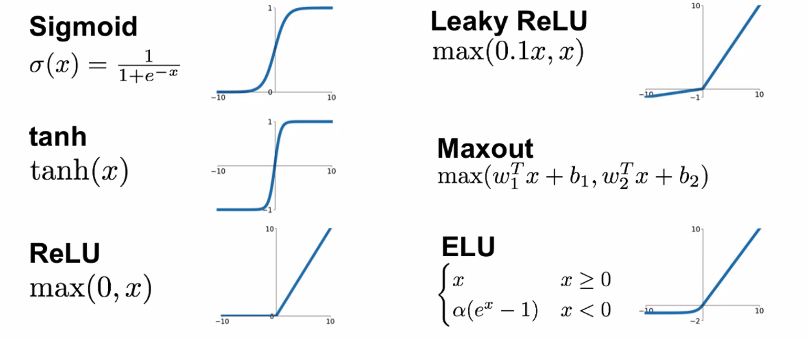
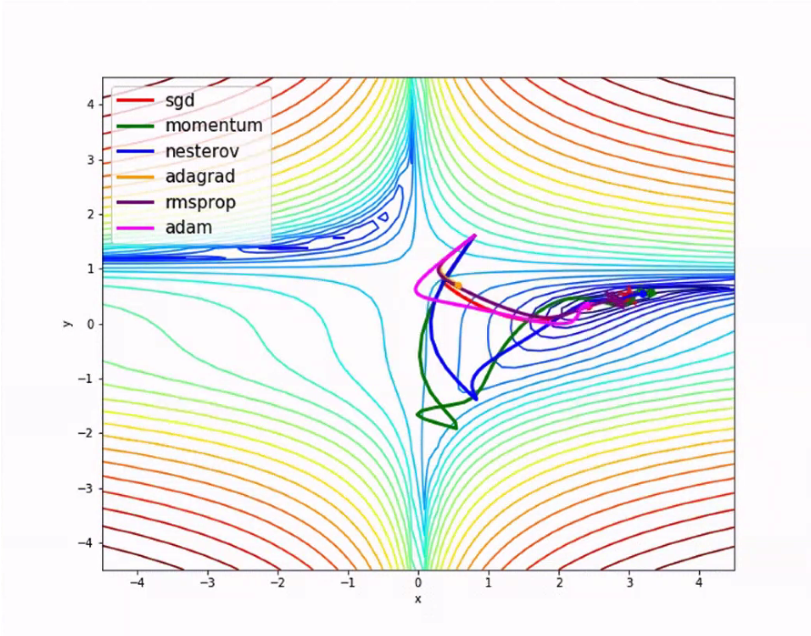
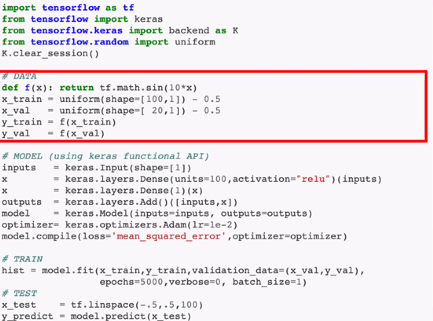
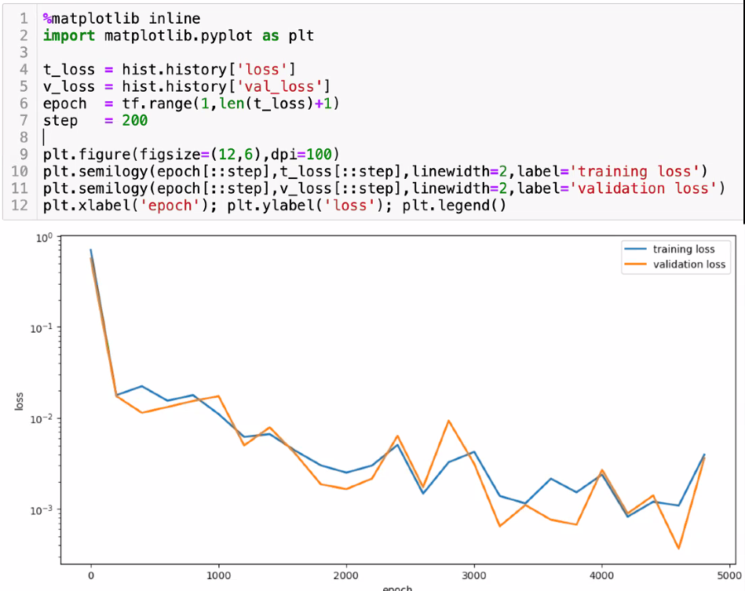
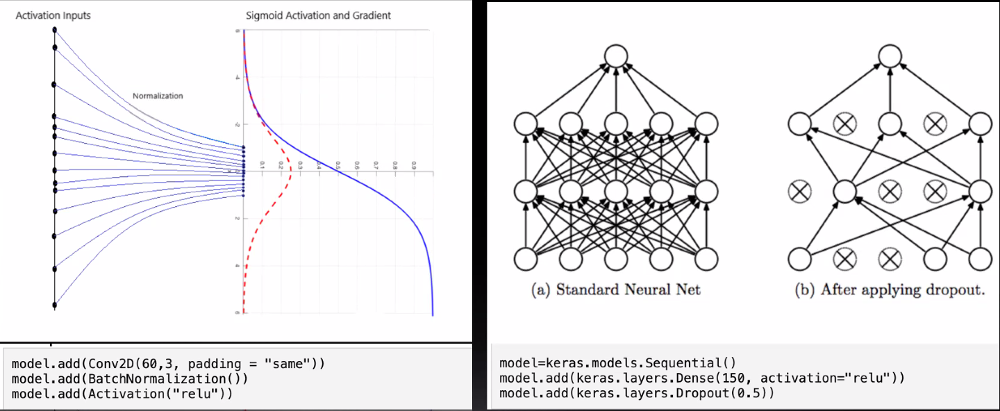
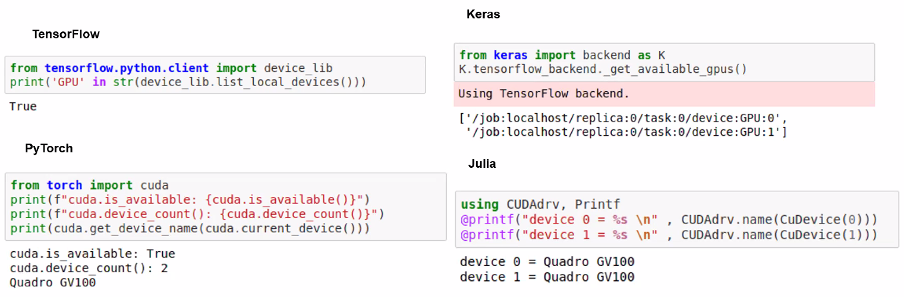
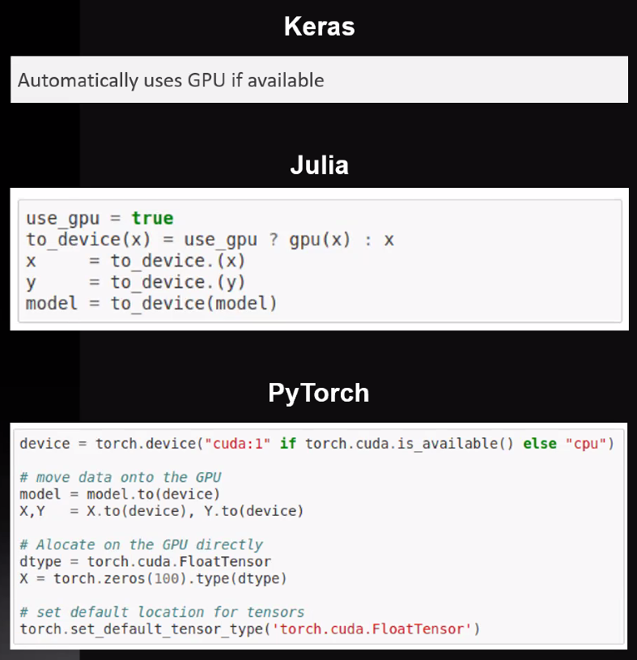
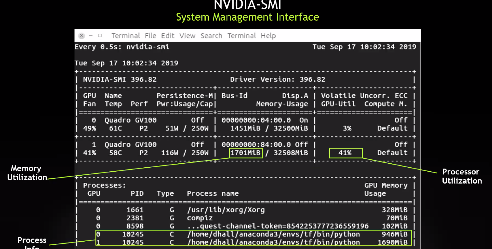
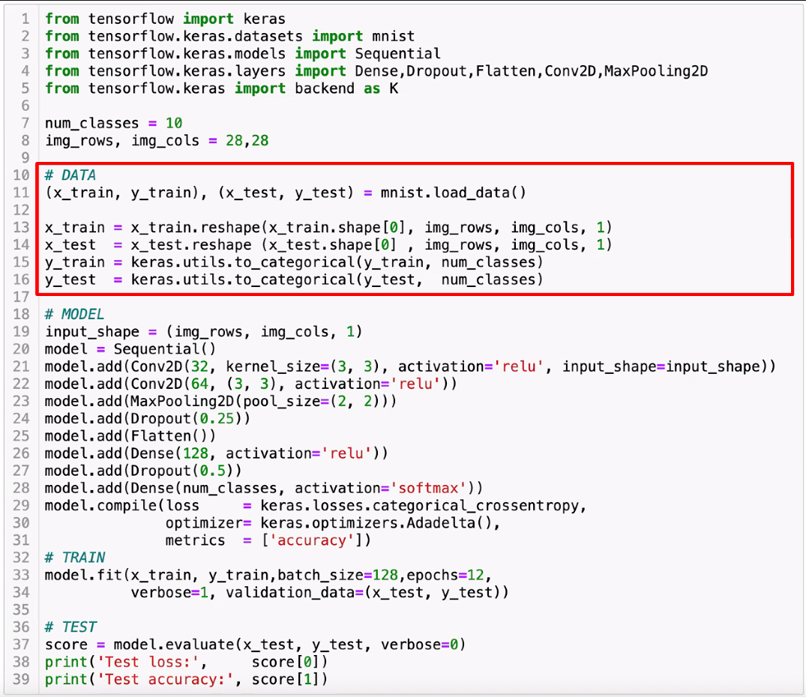
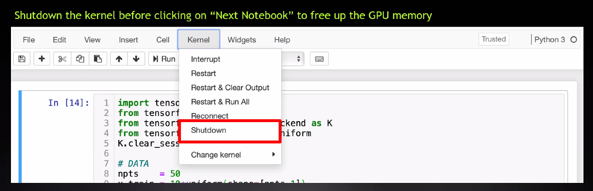

# Interactive HPC-DK AI
[Interactive HPC-DK AI For Science GPU Bootcamp master Document - Google Dokument](https://docs.google.com/document/d/1ZZ8cqPL387611wFD-Q8chIe4PA_qAqHyjdzbQAMNoMA/edit)

Typically Mostly ReLU or leaky ReLU.

[[Backpropagation (ML)]].

Algorithms for gradient descent: 

[[Regularisation]]:

Er flere parametre synonymt med flere neuroner?

## Backlinks
* [[13/10/2021]]
	* [[Interactive HPC-DK AI]]

<!-- {BearID:0F0C3F40-98A2-458F-ACF3-8D81D95807C7-33413-00000555F4F13BF7} -->
