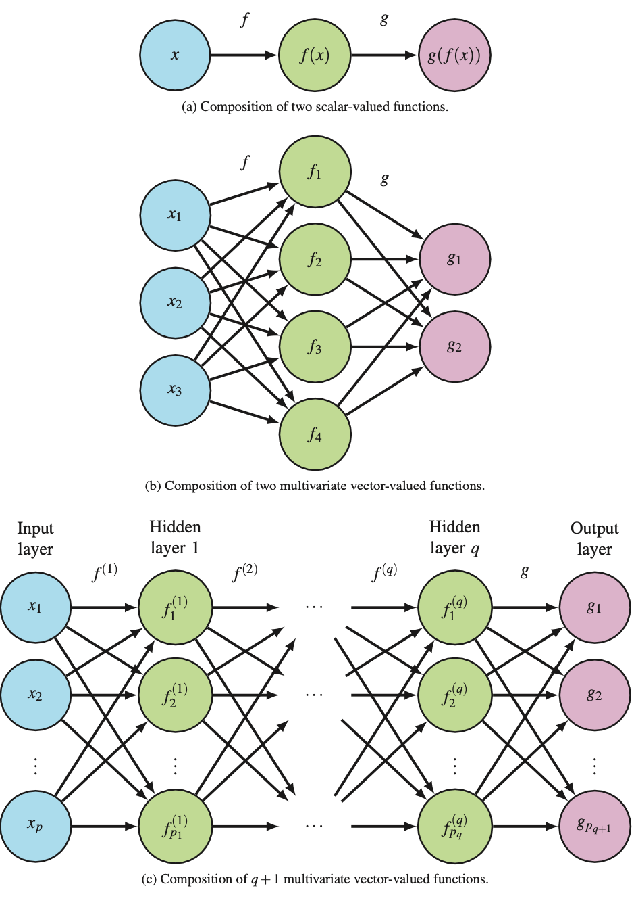

# Neural networks

* [[Single-layer feedforward neural network (use single-layer perceptron)]]
* [[Recurrent neural net (RNN)]]
	* [[Long short-term memory (LSTM) net]]
* [[Convolutional Neural Network (CNN)]]
* [[Activation function]]

[[Neural networks (deep learning): How to get better]]

Do well because they:
1. Can model interactions implicitly (Like [[Random forest]]s and [[Support Vector Machine (SVM)]]s.
2. Handle high-dimensional and collinear variables well
3. Have many ways of [[Regularisation]]

Unique benefits:

Mathematically, it's known via [[Function composition]].

<!-- #anki/deck/ML #anki/tag/machine-learning -->

---

Q. How do we define a sequence in ML?
A. A matrix, where each row is a feature vector and the rows are ordered

Q. What does it mean to classify a sequence in ML?
A. Classify the entire sequence (matrix of rows)

Q. What does it mean to label a sequence in ML?
A. Classify each row

Q. Which mathematical data type do recurrent neural networks take as input?
A. Sequences

Q. What is the typical real-world application of recurrent neural networks?
A. Text processing

Q. Why are recurrent neural networks well-suited for text processing?
A. Text is naturally ordered, well suited for a sequence

Q. What does it mean for a neural network to be recurrent?
A. The units receive information from themselves from the previous time step

Q. What is the utility of the [[Softmax]] function?
A. The [[Logistic function]] in N dimensions

## Backlinks
* [[§Machine Learning]]
	* [[Neural networks]]

<!-- {BearID:DA8D606F-1095-4400-94A8-4401C6DBC43F-5010-000013BE5B8C9D6F} -->
