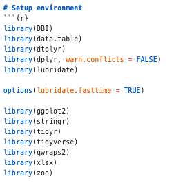
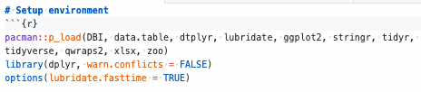

# Pacman for R
Q. How might you optimise this code?

A. 

Q. What is the advantage of using Pacman's `p_load` over `library` in R?
A. `p_load` installs missing packages

<!-- #anki/deck/Programming -->

<!-- {BearID:3883EF84-AFD7-4425-A904-97FABF1B706B-41926-00000690F917228A} -->
