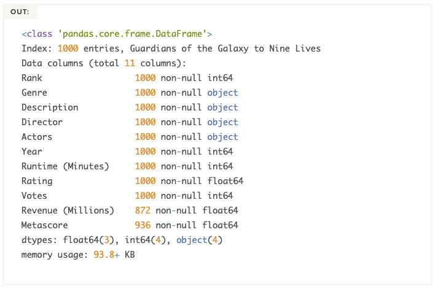
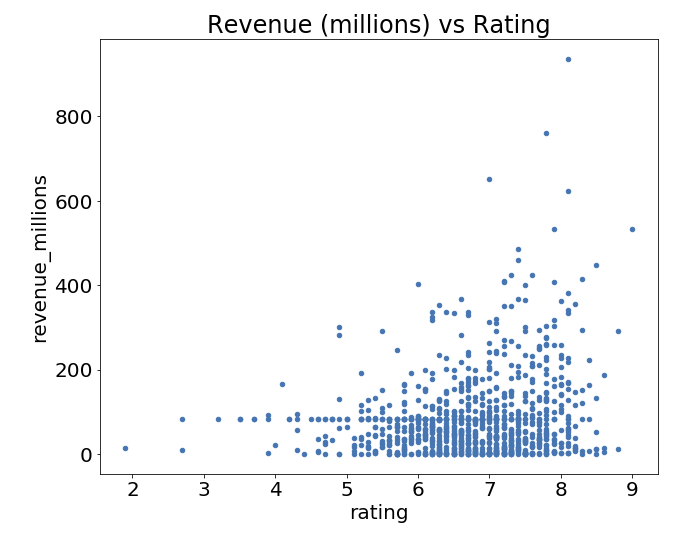
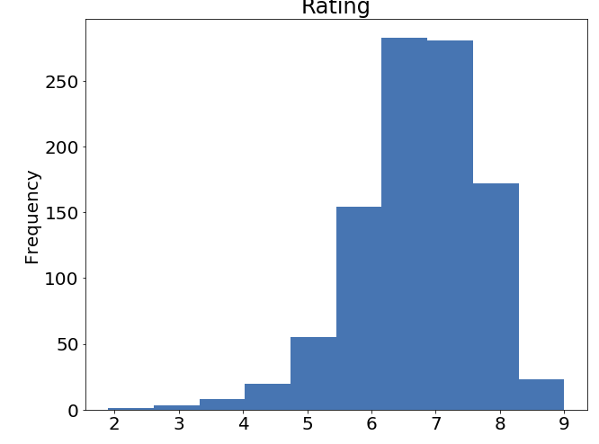
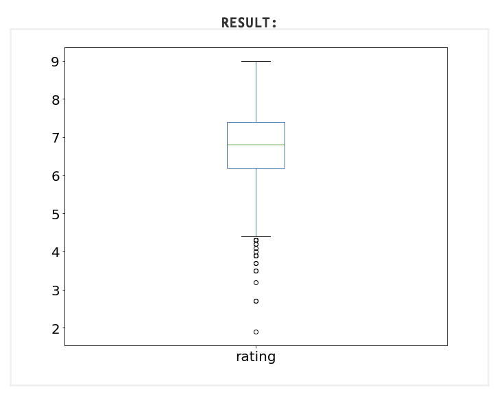
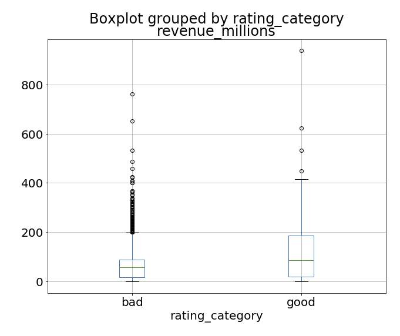
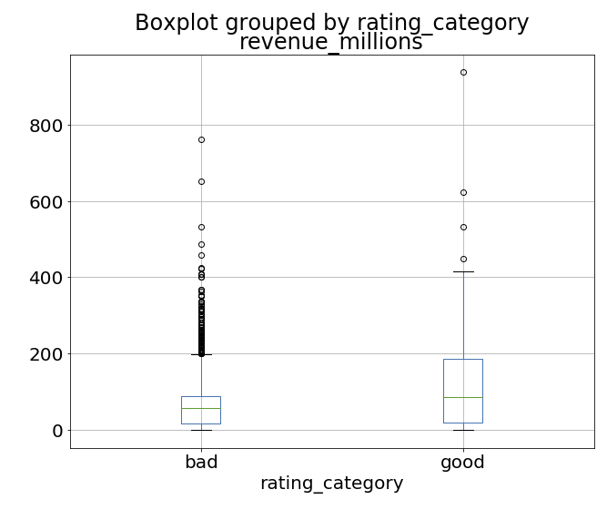
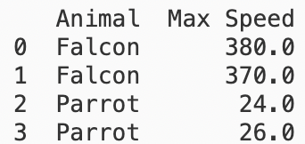
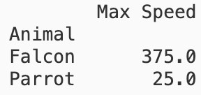

# Pandas
[[Pandas: One-hot encoding]]
[[Pandas: Dealing with missing data]]
[[Jupyter Notebooks]]

Q. What data format can be used to manually create a dataframe in Pandas?
A. It takes a dict like so:
```
data = {
    'apples': [3, 2, 0, 1], 
    'oranges': [0, 3, 7, 2]
}
```

Q. How do we create a pandas dataframe?
A. `pd.DataFrame(data)`

Q. You have a row in a dataframe in Pandas with index “str1”. How do you get the contents of that row?
A. `df.loc[“str1”]`

Q. How do you address the first 4 rows from a dataframe in Pandas?
A. `df.iloc[1:5]`

Q. How many rows do we get when using `df.iloc[1:5]`?
A. 4

Q. You have imported a dataframe in Pandas, and you would like a detailed overview. How might you do that?
A. 
```
import pandas_profiling
df.profile_report()
```

Q. You have imported a new dataframe in Pandas. How do you get a quick overview of its contents?
A. `df.head()`

Q. You have imported a new dataframe in Pandas. How do you get a quick description of its columns and its data-types?
A. `df.info()`


Q. How do you most quickly find the rows x columns of a dataframe in Pandas?
A. `df.shape()`

Q. What does `df.shape()` output?
A. A tuple of `(rows, columns)`

Q. How do you de-duplicate rows in a dataframe in Pandas?
A. `df.drop_duplicates()`

Q. How do you find the column names in a dataframe in Pandas?
A. `df.columns`

Q. How might you change the names of columns in a dataframe in Pandas?
A. 
```
	df.rename(columns={
        'PrevName1': 'NewName1', 
        'PrevName2': 'NewName2'
    }, inplace=True)
```

Q. How can you find out how many missing values are in each column in a dataframe in Pandas?
A. `df.isnull().sum()`

Q. How can you extract the df column “revenue_millions” into a “revenue” variable as a series  in python?
A. `revenue = df[‘revenue_millions’]`

Q. How can you extract the df columns ‘revenue_millions’ and ‘rating’ as a dataframe into a “revenue” variable in Python?
A. `revenue = df[ [‘revenue_millions’, 'rating'] ]`

Q. How can you get the mean of a column in a dataframe in Pandas?
A. `mean = df[“revenue_millions”].mean()`

Q. How can you replace NA values in a column with the mean? (Assume the mean is stored in a revenue_mean variable)
A. `df["revenue"].fillna(revenue_mean, inplace=True)`

Q. How might you get basic descriptive statistics of a dataframe in Pandas’s continuous variables?
A. `df.describe()`

Q. How might you get the frequencies of a categorical column in a dataframe in Pandas?
A. `df[“cat_var”].value_counts().head()`

Q. How might you generate the correlations between continuous variables in a dataframe in Pandas?
A. `df.corr()`

Q. How do we get all rows from a dataframe where “director” is “Ridley Scott” in Pandas?
A. `df[df[“director”] == “Ridley Scott”]`

Q. How do we get all rows from a dataframe in Pandas where “rating” is above 8.5 in Pandas?
A. `df[df[“rating”] > 8.5]`

Q. How do you vectorize rather than iterate over rows in a dataframe in Pandas?
A. You use `.apply()`

Q. You're working on a pandas dataframe. How might you dichotomise the column “rating” into "good" if > 8.0 and "bad" otherwise?
A. 
```
def rate(x):
    if x > 8.0:
        return "good"
    else:
        return "bad"

df["rating"] = df["rating"].apply(rate)
```

Q. How might you create this plot in pandas?

A. `df.plot(kind=“scatter”, x=“rating”, y=“revenue_millions”)`

Q. How might you create this plot in pandas?

A. `df["rating"].plot(kind=“hist”)`

Q. How might you create this plot in pandas?

A. `df["rating"].plot(kind=“box”)`

Q. How might you create this plot in pandas?

A. `df[“revenue_millions”].plot(kind=“box”, by=“rating_cat”)`

Q. How might you show the variables “rating”  and “revenue” from a dataframe in pandas in a scatterplot?
A. `df.plot(kind=“scatter”, x=“rating”, y=“revenue”)`

Q. How might you show the variable “rating” from a dataframe in pandas in a histogram?
A. `df["rating"].plot(kind=“hist”)`

Q. How might you show the variable “rating” in a box-plot in pandas?
A. `df["rating"].plot(kind=“box”)`

Q. How might you show the variable “revenue” in a box-plot in pandas, grouped by rating_cat (good/bad)?
A. `df[“revenue”].plot(kind=“box”, by=“rating_cat”)`


Q. How might you drop all rows in a pandas dataframe where median housing price is equal to 500?
A. `data.drop(data[data[“median_house_value”] == 500].index, inplace=True)`

Q. How might you transform

Into

In pandas?
A. `df.groupby([‘Animal’]).mean()`

## Backlinks
* [[Tidy data]]
	* Can be accomplished in both [[R]] and [[Pandas]].
	* For [[Pandas]], see [here](http://shzhangji.com/blog/2017/09/30/pandas-and-tidy-data/).

<!-- #anki/deck/Programming #anki/tag/Python -->

<!-- {BearID:3B0B245A-D5F5-4F11-B786-5FFC64AA19E1-2259-00000109D14D228F} -->
