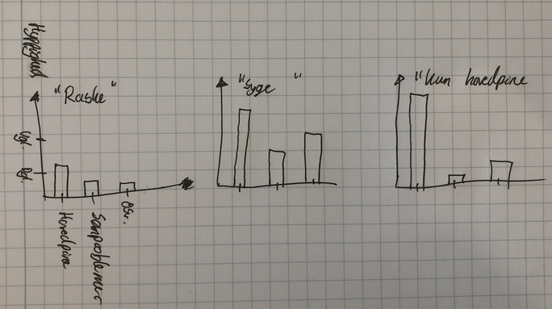
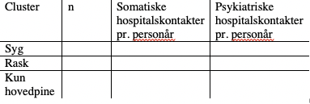

# Pitch: Cluster analyse til artikel 3
### Problemet
Vi har børn i sundhedsvæsenet og befolkningen med uspecifikke symptomer. Vi har svært ved at kategorisere, hvilke der skal have hjælp i hospitalsvæsnet, og hvilke der ville have gavn af psykologisk eller ingen intervention. At forstå, hvad der forårsager symptomerne, gør det nemmere at hjælpe børnene.

For at prioritere, hvad man skal forstå først, skal vi vide: 
1. Hvad ser vi
2. Hvad er hyppigst
3. Hvad er alvorligst

Under “hvad ser vi” skal vi vide, om symptomerne er uafhængige, om de skal ses som mindre grupper, eller om de skal ses som en samlet enhed. Derudover, hvilke af disse der er hyppigst.

Hvad der er alvorligst (både for patient og samfund) kan delvist besvares fra medicin og lægesøgning. De bliver proxyer for, hvor alvorligt læge+patient føler symptomerne er og om de forventer der kan gøres noget ved dem.

### Er problemet uløst?
Man ved allerede til dels, hvilke symptomer der er hyppigst fra WHOs 4-årige HBSC. Men vi ved ikke, om der findes grupperinger i symptomer, og ej heller, hvilke symptomer/symptomgrupper der leder til mest lægesøgning.

Grupperingerne i uspecifikke symptomer er delvist undersøgt i co-variations studier, men disse viser kun, hvilke symptomer der følges ad – ikke, om der er grupperinger i observationerne. 

### Løsningen
Cluster-analyse. Hvad er så det? Cluster-analyse leder efter grupper i observationerne, der forklarer mest varians. I animationen nedenfor simplificeret til 2 dimensioner (eg. mavesmerter og hovedpine), men kan gøres med n dimensioner.

 [Link til animation](https://media.giphy.com/media/12vVAGkaqHUqCQ/giphy.gif) 

Det adskiller sig fra PCA ved, at cluster-analyse leder efter grupperinger i observationer, PCA efter grupperinger i items (symptomer).

Eksempelvis kunne cluster-analyse finde en “rask” gruppe der scorer lavt på alle symptomer, en “syg” gruppe der scorer højt på alle, en “irritabel og nervøs” gruppe der kun scorer højt på disse to, og en “ingen andre symptomer, men søvnproblemer” gruppe. 

For at vurdere om clusters er klinisk meningsfyldte skal kontrasten mellem dem karakteriseres. Det gøres med box-plots af symptomernes frekvents, opdelt på cluster-gruppe:
Visualisering af kontrast mellem symptom-clusters. Symptom på x-aksen, hyppigheden af symptomet (dagligt/ugentligt/månedligt) på y-aksen. 1.01 MB  [View full-size](https://storage.3.basecamp.com/4883102/blobs/2a7648ba-19ce-11eb-8235-a0369f740dfa/download/IMG_0280.jpg)   [Download](https://storage.3.basecamp.com/4883102/blobs/2a7648ba-19ce-11eb-8235-a0369f740dfa/download/IMG_0280.jpg?attachment=true) 

Her blev det en bar-graph, men det viser princippet. 

For at vurdere “hvor alvorligt er det”, undersøger vi om der er kontrast mellem clusters på udfald – eksempelvis hospitalskontakter pr. personår.
Association af clusters til udfald 31.5 KB  [View full-size](https://storage.3.basecamp.com/4883102/blobs/ccf7f872-19ce-11eb-b320-ecf4bbd6f9d0/download/image.png)   [Download](https://storage.3.basecamp.com/4883102/blobs/ccf7f872-19ce-11eb-b320-ecf4bbd6f9d0/download/image.png?attachment=true) 

Men er helt åben for andre udfald :-)

### Udfordringer/svagheder
* *Pga. vores lave antal items vil vi helt sikkert overse noget.*
	* Omvendt, hvis vi kan finde meningsfyldte grupperinger allerede med 7 items, så er der stort potentiale for videre forskning.
* *Udfaldene er styret af sundhedsvæsenet.*
	* Hvis vi vil nærme os ætiologi, skal vi gerne have udfald der udelukkende er styret af patienten. Jeg tror dog ikke vi har disse.
* *Ekstern validitet*
	* Clusters kan være unikke for vores sample. 
	* Gør stadig studiet nyttigt, men vil styrkes væsentligt af out-of-sample validering (eg. i  [Danish National Youth Study](https://pubmed.ncbi.nlm.nih.gov/28914164/) , eller data direkte fra HBSC)
* *Nogle tekniske udfordringer:*
	* Skal laves i R, hvad er det relevante afstandsmål etc. Her har jeg taget et par spadestik og er overbevist om, at det skal jeg (måske med hjælp fra Stefan) nok kunne løse.

### Vil resultaterne løse problemet?
For at prioritere, hvad man skal forstå først, giver det mening at vide: 
1.    Hvad ser vi
2.    Hvad er hyppigst
3.    Hvad er alvorligst

Vi får karakteriseret, hvilke symptomgrupper der ses og hvor hyppige de er. Udfra brug af sundhedsvæsenet kan vi give en del af svaret på, hvilke clusters der opleves mest alvorlige for patient + sundhedsvæsen. 

Hvis man skal prioritere fremadrettet skal man også have en idé om, hvor der er størst potentiale for at forbedre. Det kan vi ikke svare på – men jeg tænker, at det hyppigt er et problem for eksplorativ forskning.

<!-- #service/research-idea/4. pitchable# -->

<!-- {BearID:EC197640-AD8D-458B-8A41-35F229032D25-2458-00000560144334E7} -->
