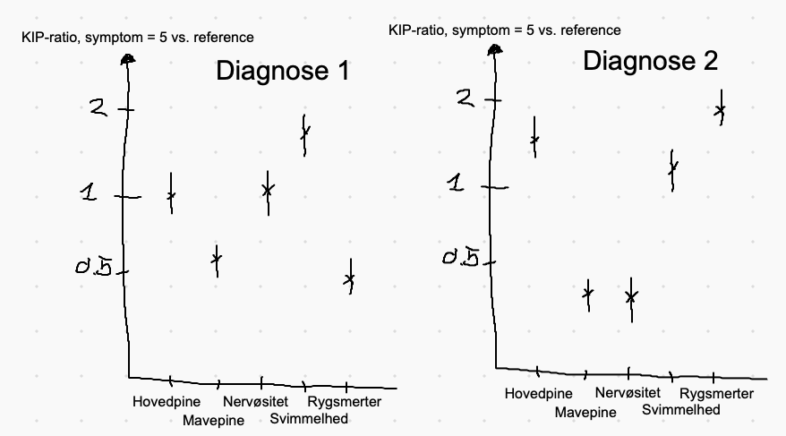

# Pitch: Which diagnoses are the different NSS symptoms associated with?
*The problem*
Self-reported symptoms in the general population are much different than the symptoms that doctors see in their practice. Only a selected subset of symptoms reach the perceived severity that patients seek medical attention for them.

But many diseases have a prodromal stage where the symptoms are non-specific. Therefore, a non-specific symptom may be associated with a disease that doesn’t typically exhibit that symptom in clinical practice, simply because the symptom isn’t dominant when the disease presents to a doctor. 

However, in the general population, we know little as to which non-specific symptoms are associated to which diagnoses. This means that we don’t know whether to study and intervene upon them as one unified entity, or as individual entities.

*Is the problem solved?*
I’ve been unable to find any evidence examining the association between non-specific symptoms and multiple different diseases.

*The solution*
First generate cumulative-incidence-proportions for each chapter in each symptom group (high vs. low). 

After that, estimate association between a given symptom (high vs. low) and each chapter, when adjusting for all other symptoms. Repeat for each symptom.

Can be used to generate a set of line diagrams, probably IRR ratios rather than KIP ratios given uneven distribution of risk time:

*Challenges/limitations*
* Vi kan relativt nemt lave p-værdier for tabellen, (chi-i-anden). Det kan være svært at kvantificere “ændret mønster” for diagnose 1 vs. diagnose 2 etc. på regressionen. 
	* @Stefan, hvis vi bliver afkrævet en p-værdi på “mønsteret af ratioer”, er det så noget vi kan komme op med?

*Does this solve the problem?*
If symptoms are strongly differentially associated with different diagnoses, it indicates that they are different entities. This means that they can have differential causes and may need differential study and intervention.

If not, it indicates that they are part of general illness-perception.  This means that they may have similar causes and may be studied and intervened upon as a whole.

We examine both hypotheses in our study.

This can be something like “non-specific symptoms and non-specific outcomes – an exploration into the grey area of the hospital system”.

Further questions are [[Pitch: Are NSS associated with Z- or R-diagnoses]].

<!-- #service/research-idea/4. pitchable# #p3 -->

<!-- {BearID:23642CF0-2AA3-4836-8AC0-FEE6485148A5-2458-000005F7F9786B7E} -->
