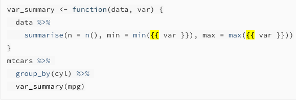
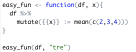
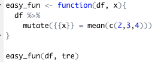
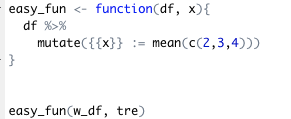
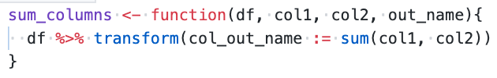
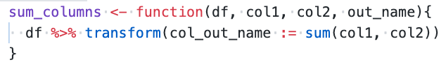
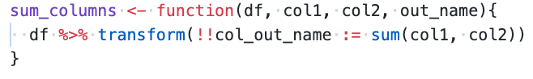

# Programming in dplyr
Q. When would you use double-curly brackets {{ in R?
A. When referring to a variable from a function argument inside a dplyr function, e.g:


Q. You want to run a function on each row in dplyr (the function isn't vectorised). How might you do this?
A. 
```
df %>%
	rowwise %>%
	function() %>%
	unnest
```

Q. Why does this not work? 
```
df <- df %>%
     mutate({{x_col}} = detrend_fn({{x_col}}, ...))
```
A. Assignment with double curly requires “:=“,  otherwise R throws a syntax error due to curly braces left of assignment

Q. Why does this not work? 

A. dplyr verbs do not take strings as input

If this is the case, how do we make programmable column titless?

Q. 

This function call returns an error. How do you correct it?
A. Unquote “tre”

Q. This function call returns an error. Why is that?

A. Assignment with double curly requires “:=“,  otherwise R throws a syntax error due to curly braces left of assignment

Q. Why do you need to use “:=” here? 

A. Assignment with double curly requires “:=“,  otherwise R throws a syntax error due to curly braces left of assignment.

Q. Why does this not work?

A. You need to use `!!col_out_name` to mark that it should pull from variable names.

Q. The following code returns an error.

How do you fix it?
A. 



<!-- #anki/deck/Programming #anki/tag/R -->

<!-- {BearID:63E4BE7F-EED6-4D33-8D63-D74F3C2B11D4-3579-0000002353922545} -->
