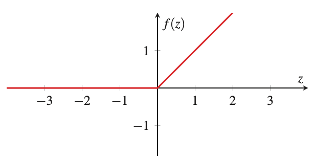

# Rectified linear unit (ReLU)
Q. What does ReLU stand for?
A. Rectified linear unit

Q. What is the ReLU mathematically?
A. The activation function f(x) = max(x, 0)

Q. Which function does this plot?

A. [[Rectified linear unit (ReLU)]]

## Backlinks
* [[Rectified linear unit (ReLU)]]
	* Q. Which function does this plot?
A. [[Rectified linear unit (ReLU)]]
* [[Activation function]]
	* [[Rectified linear unit (ReLU)]]

<!-- #anki/deck/ML -->

<!-- {BearID:9DEEA6AF-50E8-423E-957C-4B6AD3CD8E5B-43256-00000189B17517EB} -->
