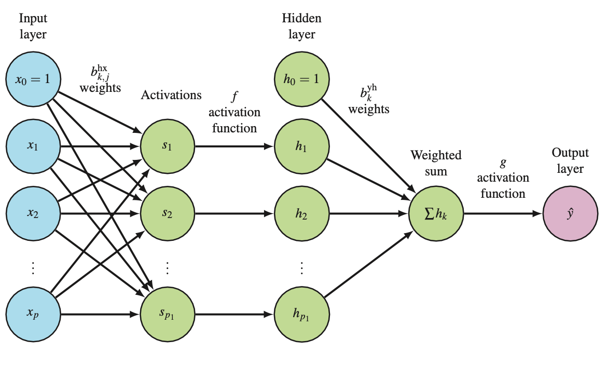

# Single-layer perceptron
Q. Describe the path of information from one node in the input layer to one node in the output layer of a [[Single-layer feedforward neural network (FNN)]].
A. 0) Input layer, 1) Weighting, 2) Activation function for hidden layer input, 3) Weighted linear regression, 4) Weighted sum, 5) Activation function for hidden layer output

Q. Which model does this diagram represent?

A. A [[Single-layer perceptron]]

Q. How do you adapt the [[Single-layer perceptron]] for single-class classification? 
A. Change the output layer activation function to be the [[Logistic function]].

Q. How do you adapt the [[Single-layer perceptron]] for multi class classification?
A. Change the final activation function to the [[Softmax function]].

## Backlinks
* [[Single-layer perceptron]]
	* Q. Which model does this diagram represent?
A. A [[Single-layer perceptron]]
	* Q. How do you adapt the [[Single-layer perceptron]] for single-class classification? 
	* Q. How do you adapt the [[Single-layer perceptron]] for multi class classification?
* [[Single-layer feedforward neural network (use single-layer perceptron)]]
	* Also known as the [[Single-layer perceptron]].

<!-- #anki/deck/ML -->

<!-- {BearID:F7DE6591-CA71-41D5-A79C-EA84D9479EF0-43256-000001892BBAD5EA} -->
