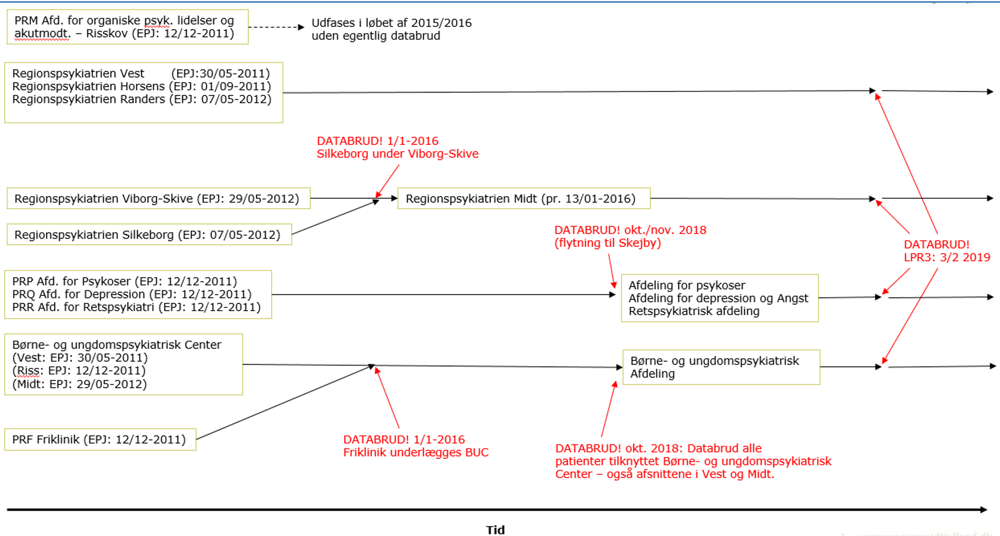

# test

* Dispositioner
* Social anamnese, Psykiatri
* Tidligere psykiatrisk
* Præmorbid psyke
* Tidligere tvang
* Tidligere somatisk, psykiatri
* Skolegang
* Graviditet, fødsel og udvikling, psykiatri
* Sprog, kultur og religion

<!-- {BearID:A7D36A24-3E3A-4304-9581-81404DDCB46B-9822-000001A0A3C6A5E9} -->
