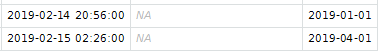

# 25/10/2021 - Work
*How am I feeling today?*
Pretty good, excited to get to work! A few obligations this week to ensure that I'm ready for the most important stuff.

* Skrive til Søren om mødelokaler til torsdag

*Main*
- Outline slides til 2. November
	- Hvad mangler jeg at generere, for at jeg kan lave de slides gode?
	- Hvornår kan jeg nå at generere det?
		- Logseq: *Mini-symposium for ADA-forskningsenheden*
* LPR2->LPR3
	* Tjek op på afrunding - hvilke LPR3 records ender før LPR2->LPR3 overgangen, og hvorfor?

	- Ændre analyser med inpatient ud fra pt_type
	- For the mitigation strategies, we want to examine whether there's a strategy that results in similar estimates pre- and post the transition
		- As such, we want to plot estimates both pre and post
		- This requires that I can identify something similar to a "forloebsansvar" in LPR2
		- The closest is going to be the LPR2-contact
		- I want to do that, then
			- See if I can combine dw_sk_kontakt with dw_sk_lpr3forloebsansvar
	* In subchapters, when examining mitigations, I get
		* Way too high for F2
		* Way too low for final_visit for all 
			* Perhaps a rounding error?
		* Might that be because
		* Refactor utility functions
	* Offset subchapters based on "origin" to avoid visual overlap
* T2D/CVD
	* Hvad mangler jeg for at kunne besvare vores spørgsmål?
	* Gøre graferne flottere

*Afternoon*
- Høre Lasse om datascience gut
- Læse op til journal club
* Journal club
* Nourish seedlings

* Læse op til psyk-læseklub
	* Flytte vaccinationstid

*Misc*
- Skrive rundt om møde i morgen
- Forberede mig til gruppemøde

*På vej hjem*
* Købe ind til risotto

<!-- {BearID:1E5AA7BB-0379-42DA-81DB-CEA04E2BE9A2-860-00000000833BAEB2} -->
