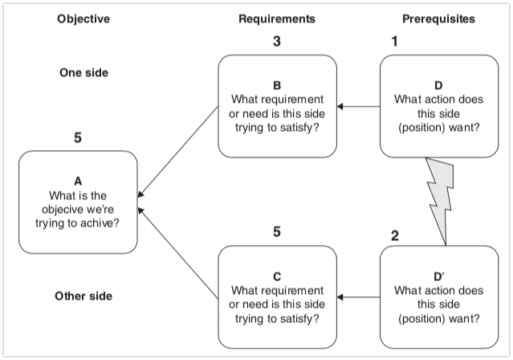

# Evaporating Cloud
More detail in Roam.

# Tips before you begin
Don’t let feasibility enter into the equation. You are generating ideas, not solutions, and feasibility dramatically decreases creativity. When you have a bunch of ideas, it’s time to validate them. If the complexity is high, you can use the [[Future Reality Tree (FRT)]] and the [[Prerequisite Tree (PRT)]] for that.

# How to do it
## Construct the cloud

1. Define desired actions, ie. “what does each side want”?
2. Define the requirements, ie. why do they want it?
3. Define the common goal

## Surface assumptions
For each arrow or bolt of lightning, there’s going to be assumptions. 
1->3: In order to 3, we must 1 because: XYZ
1 ≠ 2: On the one hand, we must 1, but on the other hand, we must 2. We can’t do both because: XYZ

Include even invalid assumptions, if one person holds them. Also word them as extremely as possible.

## Question the assumptions
Which assumptions are invalid? If none appear invalid, what would our actions be if one of them were invalid? Use it to generate ideas.

## Generate injections
For invalid assumptions, how can we use that to drive ideas? Ie. “Spending more money on advertising is the ONLY way to increase sales revenue” –> How can we increase sales revenue without spending more money on advertising? Or are there cost-effective options? 

---

Q. After drawing an evaporating cloud, what do you do with it? 
A. 1) Surface assumptions, 2) Question the assumptions, 3) Generate injections

Q. What are the steps of drawing an evaporating cloud?
A. 1) Define the conflicting desired actions, 2) define the reasons for those actions, 3) define the common goal of the system

## Backlinks
* [[Mapping systems reveal non-intuitive points for intervention]]
	* Especially in systems with feedback loops. One easy, light-weight way of mapping them is [[Loopy]], alternatively the procedure from [[Evaporating Cloud]].
	* Q. You disagree strongly with someone about which actions to take. Which thinking tool might help?
	* Q. Recall a time you disagreed strongly with someone about which actions to take. Which thinking tool might’ve helped?
* [[Can I build a healthy relationship with gaming?]]
	* Use something like the [[Evaporating Cloud]] to question assumptions.
* [[Perception Control Theory (PCT)]]
	* Resolving conflict requires moving attention to the level where conflict resolution is possible - diagramming (e.g. [[Evaporating Cloud]]) can help with that.

<!-- {BearID:D0EBD24C-8FFF-4ABC-A23B-CA9A3AC4B394-75682-000075BC3D56BE69} -->
