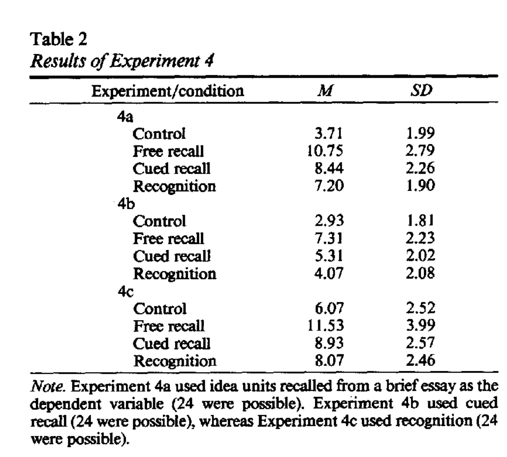

# Glover 1989

Encoding session, 300 word essay, 10 minutes allowed.

4a is testing using free recall, 4b using cued recall and 4c recognition. The lines are named for the type of practice that was done in the intervening session.

## Backlinks
* [[Avoid cloze deletions]]
	* Free recall outperforms the other two in how well they train memory. [[Glover 1989]].

<!-- #Life -->

<!-- {BearID:CCCA8FB2-0543-483A-8698-ED97CC14A744-15756-0000130368B49082} -->
