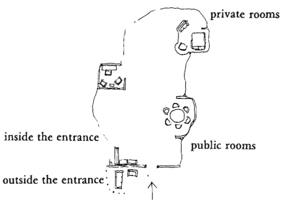

# Interior Design
*Entrance*
A place to put things down
A place to get dressed - clothing, keys, headphones etc.
Window, to see who’s coming
Allow the door to open wide for politeness
A place for dirty boots
Seating to get dressed

*Couple’s realm*
Sitting area for projects and conversation
Acoustically separate from the rest of the house
Dressing area

*Kitchen*
Merge the kitchen and the common room, with a big table in the kitchen for community
Hang a big, warm light over the table

*A room of one’s own*

*A sequence of sitting spaces*
Gradually more intimate and enclosed.

Have regular dinners, and have them be open to others for groups to overlap.

*Eating area*
More light at eating area (and less around) to feel close
Space to pull chairs back and relax

*Enclose workspaces*
Wall behind you
Wall on one side of you
View to the outside (or emulate)

*A circle of Seating*

<!-- #p1 -->

<!-- {BearID:6F85057E-D54B-4639-8B11-D9D7726D7DBD-27460-00000603A1778C97} -->
