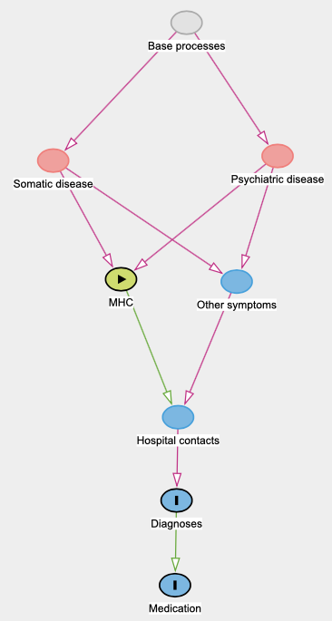

# Is the MHC flow in hospital generally appropriate
If MHC is best handled in hospital, and not an indicator of general ill-being, the ideal flow for MHC is dependent on symptom load.

This is under the naive assumption that MHC can only be caused by a somatic or psychiatric disease:

[[DAG-code 1]]

When symptom load is high, we want to diagnose the cause of the symptoms, and then continue hospital contacts if required (ie. if there is diagnosis of a chronic disease). Relative to no MHC, we expect the pattern to be:

T0: Starting hospital contacts, baseline difference in diagnoses
T1: More hospital contacts and more diagnoses
T2: Fade out hospital contacts if no diagnosis, maintain hospital contacts if diagnosis of chronic disease.

The alternative is that they are handled poorly, that they end up with needlessly long diagnostic workups without any real diagnoses:

T0: Starting hospital contacts, baseline difference in diagnoses
T1: More hospital contacts, constant amount of diagnoses
T2: Continuing hospital contacts whether diagnosis or not

The above is a general idea, but for publication and scientific rigour it is still expected to make [[Testable hypotheses for whether MHC is handled appropriately at hospital]].

Open questions:
* [[Do we want to adjust for baseline incidence of outcome]]

## Backlinks
* [[Are adolescents with NSS in need of more interventions?]]
	* [[Is the MHC flow in hospital generally appropriate]]
* [[§Towards an understanding of Multiple Health Complaints]]
	* [[Is the MHC flow in hospital generally appropriate]]
* [[Are MHC in need of more interventions]]
	* [[Is the MHC flow in hospital generally appropriate]]

<!-- #service/research-idea/2. shapeable# #r1 -->

Simpler alternatives are:
Censoring when diagnosed?

It runs the risk of "data-driven hypothesis generation", so we may want to explore alternatives, like how many z-diagnoses do the children get.

<!-- #service -->

<!-- {BearID:19268AA4-95CF-4EB2-A1DA-5B6838B79192-15756-0000130BCB42579F} -->
