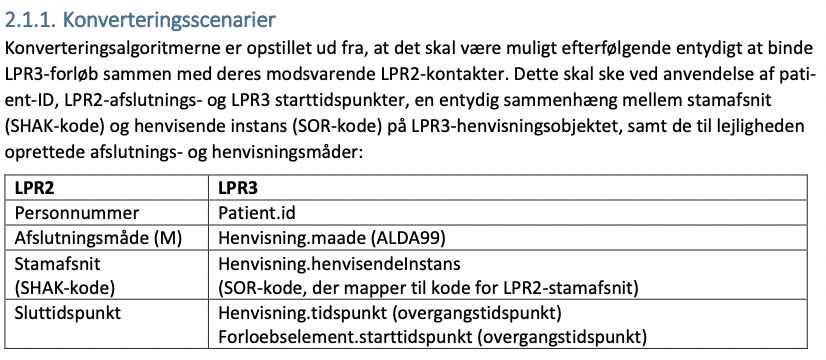
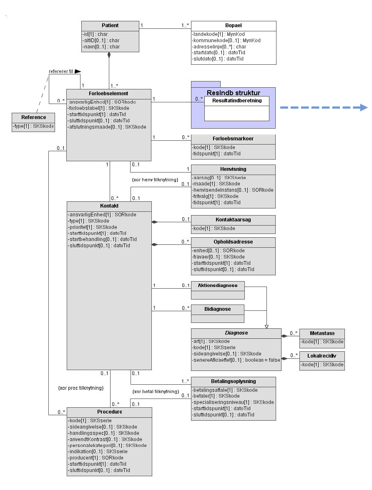
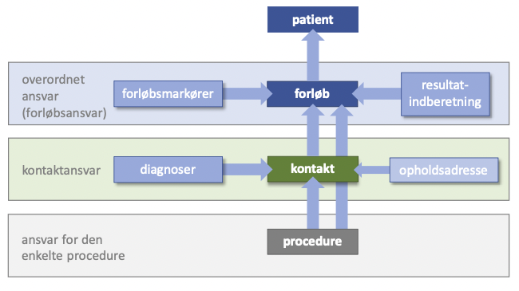
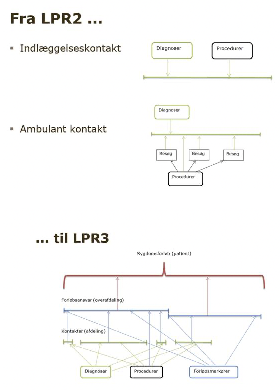
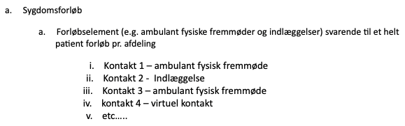
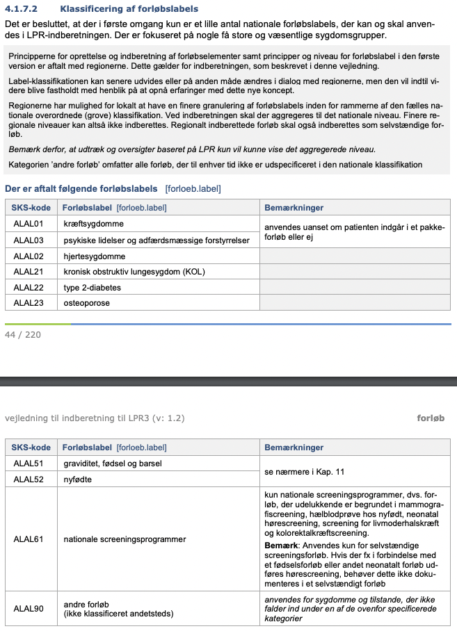
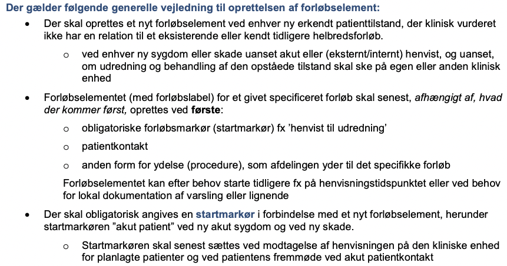
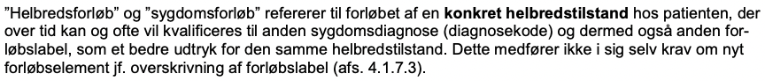
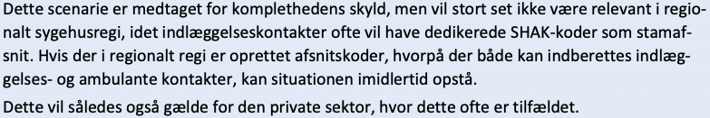

# LPR2->LPR3
# Overgangen fra LPR2->LPR3 er den 2 til d. 3 februar 2019!!! Find alle steder vi har skrevet det.

Skal vi måske i stedet lave analyserne på niveauet af kontakter? Omvendt havde man i LPR2 en “uafsluttet kontakt”.

*LPR3-model*

For LPR3-kontakter gælder, at aktionsdiagnosen skal være gældende for den konkrete kontakt – f.eks. den konkrete indlæggelse, eller det konkrete besøg i ambulatoriet. 

- *Under hvilke omstændigheder opdeles et sygdomsforløb til to sygdomsforløb i LPR3? E.g. et udredningsforløb af psykiatriske symptomer der starter med mistanke om skizofreni men ender med bipolar vil bestå af to forløbselementer – men vil de være separate helbredsforløb, og dermed få forskellige forløbslabels?*
> Forløbet indberettes, afhængig af lokal organisatorisk opbygning, som et eller flere sammenknyttede *forløbselementer*, hvor det enkelte forløbselements varighed udtrykker perioden, hvor en klinisk enhed (SOR) har helt eller delt forløbsansvar for det aktuelle helbredsforløb.

- *Vil vi finde den sidste diagnose for et forløbselement eller for et samlet sygdomsforløb?* 

Nok for det samlede sygdomsforløb, da dette i princippet opkvalificeres løbende.

- *Og vil vi kun finde dem for afsluttede forløb, eller også for åbne forløb?*

- *Hvornår afsluttes et forløbsansvar?*

Vi skal ignorere kontakter afsluttet med afslutningsmåde “M: afsluttet til LPR3”.

*LPR2-model*
Et “forløb” i LPR3-terminologi kan i LPR2-terminologi bestå af:
1. En eller flere indlæggelses-kontakter, hvor der dog kun kan være en åben kontakt pr. afdeling ad gangen
2. En eller flere ambulante kontakter, hvor man godt kan have mere end en åben ambulant kontakt til samme stamafsnit

For LPR2-kontakter gælder: /“Aktionsdiagnosen (og eventuelle bidiagnoser) på en kontakt skal til enhver tid være dækkende for hele kontakten”/

- Validering af at diagnoserne bruges deskriptivt ens på tværs af overgangen er godt, men test af om modellen er temporalt stabil på tværs af bruddet er bedre. Skal vi gøre det konsekvent?

[[MidtEPJ]]

## Backlinks
* [[05/10/2021]]
	* Collate Logseq notes on [[LPR2->LPR3]] so that you can communicate your ideas to Andreas/Søren
* [[13-Dec-21 - Work]]
	* [[LPR2->LPR3]]
* [[14-Dec-21 - Work]]
	* [[LPR2->LPR3]]
* [[15-Dec-21 - Work]]
	* Fix minor issues with [[LPR2->LPR3]], then it should be ready for manuscript update (I hope!!!)
* [[16-Dec-21 - Work]]
	* [[LPR2->LPR3]] diagnoses manuscript
* [[50-21 - Work]]
	* [[LPR2->LPR3]]
	* Setup bookdown for more safe iteration on [[LPR2->LPR3]]

<!-- {BearID:4640BC8C-F9A1-441F-8DFD-1F4B4E5E0E9B-4675-00000033C5BF95BE} -->
