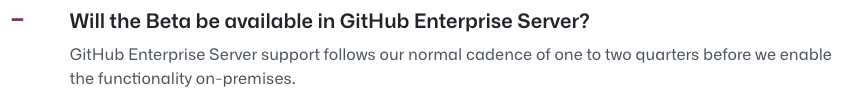

# ML PhD: Project management
For the first time, we're multiple people working on a major project with many internal dependencies.

As such, it makes sense to visualise these. We want rough scheduling ([[Rough scheduling increases autonomy]]), to visualise dependencies/the critical path, and to move forwards together.

We also want as few logins as possible, as little manual work as possible, and for it to be integrated closely so that we avoid staleness.

*Github Issues*

Can we wait for this? There's a waiting list on the website, and then further wait until it shows up on the enterprise end. It means that we'll want to have as much of the code on github.com as possible, and that means higher risk of data-leakage. 

We can handle dependencies as a periodically updated taskheat diagram, and then use regular issues to plan the nitty-gritty stuff. This is probably the best move.

Do we have decent alternatives?

<!-- {BearID:0414779D-4700-4395-A863-630A1466A77B-43256-000000B700DD7A79} -->
