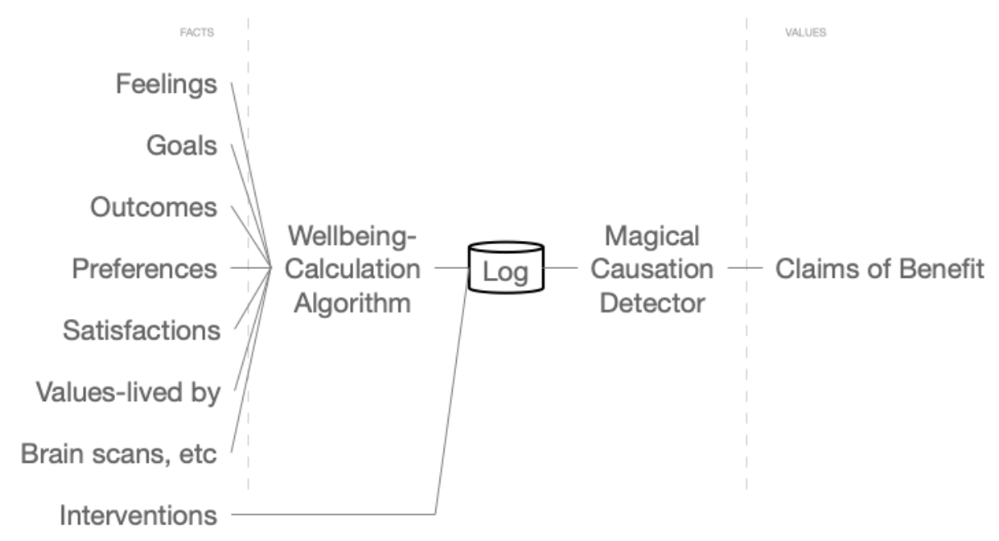
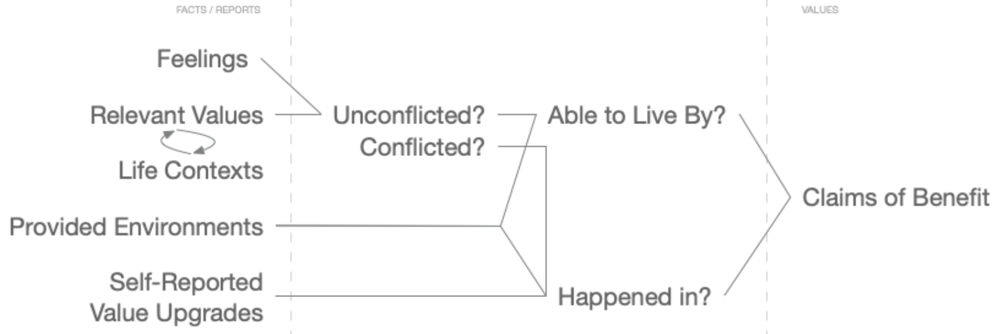

# Operationalising meta-ethics
Rules are ways of verifying whether an action was good.

[Notion – The all-in-one workspace for your notes, tasks, wikis, and databases.](https://www.notion.so/How-to-Operationalize-Metaethics-2919bbd6a882487fb3083029feaceffa)

*Rule 1: Actions are good if they make us happier*
Happier now, in the future or in total? If you want both now and in the future, and those struggle, an external agent is likely to decrease the balance between those (*taking sides*).

Furthermore, sometimes we don't want to be happy. We don't want to be force-fed drugs to feel bliss when our friend just died, and it removes agency.

*Rule 2: Actions are good if they help us reach our goals*

An *inceptive* rule is one under which it's easy to justify interventions which aren't actually beneficial. A rule for genies and mad scientists.

We often have a ton of goals. If a separate agent wants to, they might optimise for a goal that isn't terribly important to us.

Furthermore, some things (our values, like being free, or "being dutiful") can't be specified as goal states, but are nonetheless important. Eg. writing an essay can be both free and forced.

Lastly, some harms aren't goal-states either, like not feeling like agency.

*Rule 3: Actions are good if they help more people satisfy their revealed preferences*

*Rule 4: Actions are good if they advance our well-being or flourishing*

Is vulnerable by not being possible to check, and by being immensely important to nudge if possible (eg. bad actors would be highly incentivised to change this universal algorithm).

Also amounts to choosing "all of the above" for the rules, inheriting my of the vulnerabilites.

*Rule 4b: Actions are good if they advance our knowledge* 

*Rule 6: Actions are good if they help us live by our values*

One problem, it doesn't facilitate figuring out which values are important.

*Rule 6b: Actions are good if they help us live by our present and future values*

> Because a person’s values may diverge from others’ values and still be right, and because they can be intuitive, inexplicable, and result from experimentation and reflection which only that one person has done, a person must be considered the authority as to their own values.

> To sum up, values are debatable, intrapersonally convergent, and interpersonally divergent. These traits, together, mean that a person is the authority about which values work for them.

For that reason, we might want to support people to either a) Live by their values og b) Experiment with new values that might better fit them.

However, we might sometimes live as a social performance (to /seem/ happy) rather than on our own terms (to /be/ happy). To avoid that, we might ask about it.

<!-- {BearID:9A4F7A21-8075-4865-A259-761AC5CCFC00-40235-00004663CD9C832F} -->
