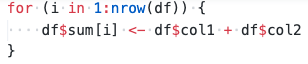
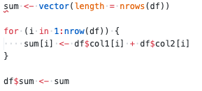

# R - avoiding rewriting dataframes
Q. How do you get the number of rows in a dataframe in R?
A.  `nrows(df)`

Q. Assume that the below operation cannot be vectorised. Why is this an antipattern in R?

A. When writing directly to a df, R has to duplicate the df and then garbage collect

Q. How might you rewrite this for better performance?

A. 

<!-- #anki/deck/Programming -->

<!-- {BearID:250DC036-D363-407F-B3EC-9DCB739525A9-98018-0000019AF7D37711} -->
