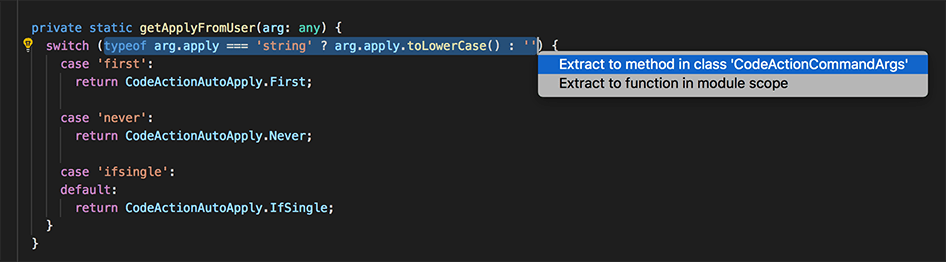

# Refactoring in VSCode
Get better at refactoring in VSCode, [Refactoring source code in Visual Studio Code](https://code.visualstudio.com/docs/editor/refactoring).

[[Code navigation in VSCode]]

Q. You have a large group of code that’s hard to understand. How might VSCode help you divide it into simpler chunks?
A. 

## Backlinks
* [[§Refactoring]]
	* At the IDE, where some tools make your life much, much easier. [[Refactoring in VSCode]]
* [[Extreme Programming Pocket Guide by chromatic]]
	* Figure out how to do those refactorings in your IDE, [[Refactoring in VSCode]]

<!-- #service #p1 -->

<!-- {BearID:9882C830-E331-4D67-88DE-9AB91FB1C414-43256-00000173505B0053} -->
