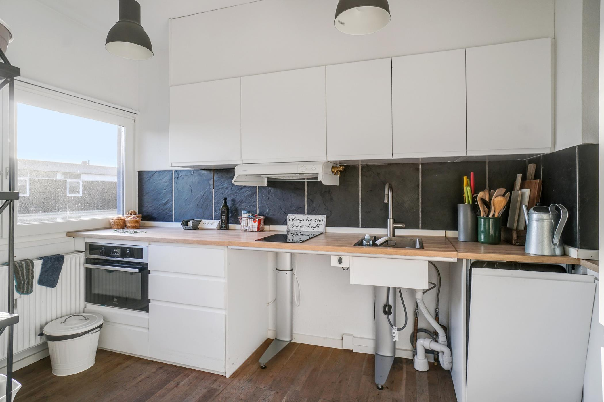
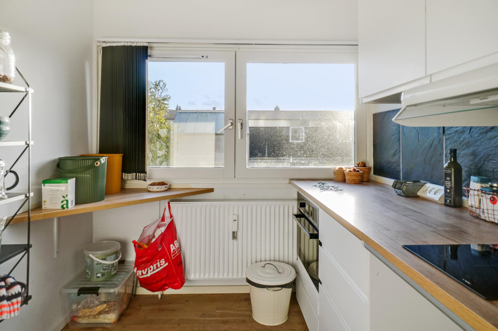
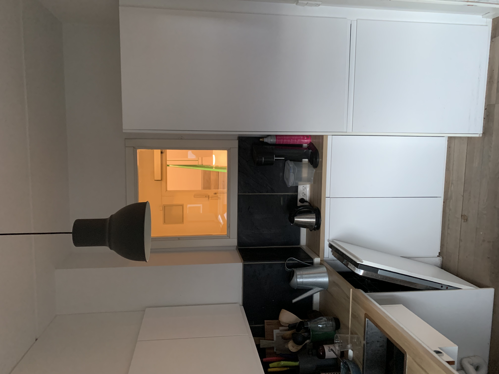

# Reno Vestervang: Køkken (14.500)
[[§Køkkenindretning]]
https://kitchen.planner.ikea.com/planner/#/dk/da/

[[§Køkkeninspiration]]

[[Tilse Vestervang 34]]
* Kan jeg få fliserne ned uden også at tage overskabene ned? 
* Hvordan er de elektriske tilslutninger?
* Kan jeg skifte emhætten?
* Kan jeg flytte emhætten?
	* Kan jeg fjerne det der er over skabene?

Afstand mellem opvasker og skab er 136 (inkl. sidebeklædning)

* Husk at bred/smal ved underskabe skal matche overskabe, så emhætte passer
* Overvej overskabe som underskabe på venstresiden for mere opbevaring. Eller underskabe med lav dybde.

Case-studies:
1. Washing up, putting into washing-machine
2. Chopping food and adding to pressure-cooker
3. 

*Minimum*
1. Skifte bordplade (5.000), [[Køkkenbordplader Vestervang]]
2. Nye underskabe (5.200)
3. Nye lister (300)

*Tilføjelser*
* Belysning under skabene
* (Ny emhætte: https://www.ikea.com/dk/da/p/underverk-indbygningsemhaette-rustfrit-stal-70389139/)
* (Nye fliser)
* (Ny opvaskemaskine med Zeolith)

Til affaldssortering:
* [DIMPA Pose til affaldssortering, hvid/mørkegrå/lysegrå, 22x35x45 cm/35 l - IKEA](https://www.ikea.com/dk/da/p/dimpa-pose-til-affaldssortering-hvid-morkegra-lysegra-40180136/)
* [METOD Underskabsstel, hvid, 60x60x80 cm - IKEA](https://www.ikea.com/dk/da/p/metod-underskabsstel-hvid-50205626/) 

[SKATTÅN Hængeopbevaring - IKEA](https://www.ikea.com/dk/da/p/skattan-haengeopbevaring-30465757/)

<!-- #p0 #hp -->

<!-- {BearID:5F27F8E0-29C8-4976-A6DA-8BC8238500AF-83270-00000594898278B4} -->
