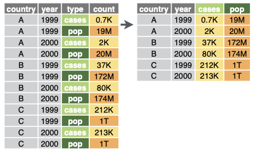
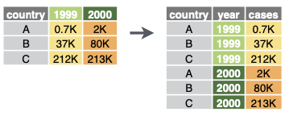

# Reshaping data
Q. What is the function for this data-reshape called *in the tidyverse*?

A. `pivot_longer`

Q. What is the function for this data-reshape called *in the tidyverse*?

A. `pivot_wider`

Q. What is this data-reshape called *in Pandas*?

A. Melt

Q. What does a transformation using Pandas’ *melt* method look like?
A. 

Q. What is this data-reshape called *in Pandas*?

A. Pivot

Q. What does a transformation using Pandas’ *pivot* method look like?
A. 

## Backlinks
* [[Data-wrangling]]
	* [[Reshaping data]]

<!-- {BearID:0D607C82-5BB0-47D7-B425-C0A938D4B3E7-60700-00000351C892E624} -->
