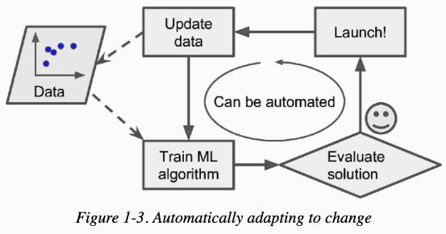

# Tidsmæssig stabilitet
Distribution shift

Might we be able to implement the model in a way that automatically updates? 

Also known as [[Batched or incremental-live learning for ML-predictions]].

<!-- #service #p1 -->

<!-- {BearID:44E739D0-B4E2-4811-9448-9EEE57E2C5D5-7959-0000187DBBD017E5} -->
