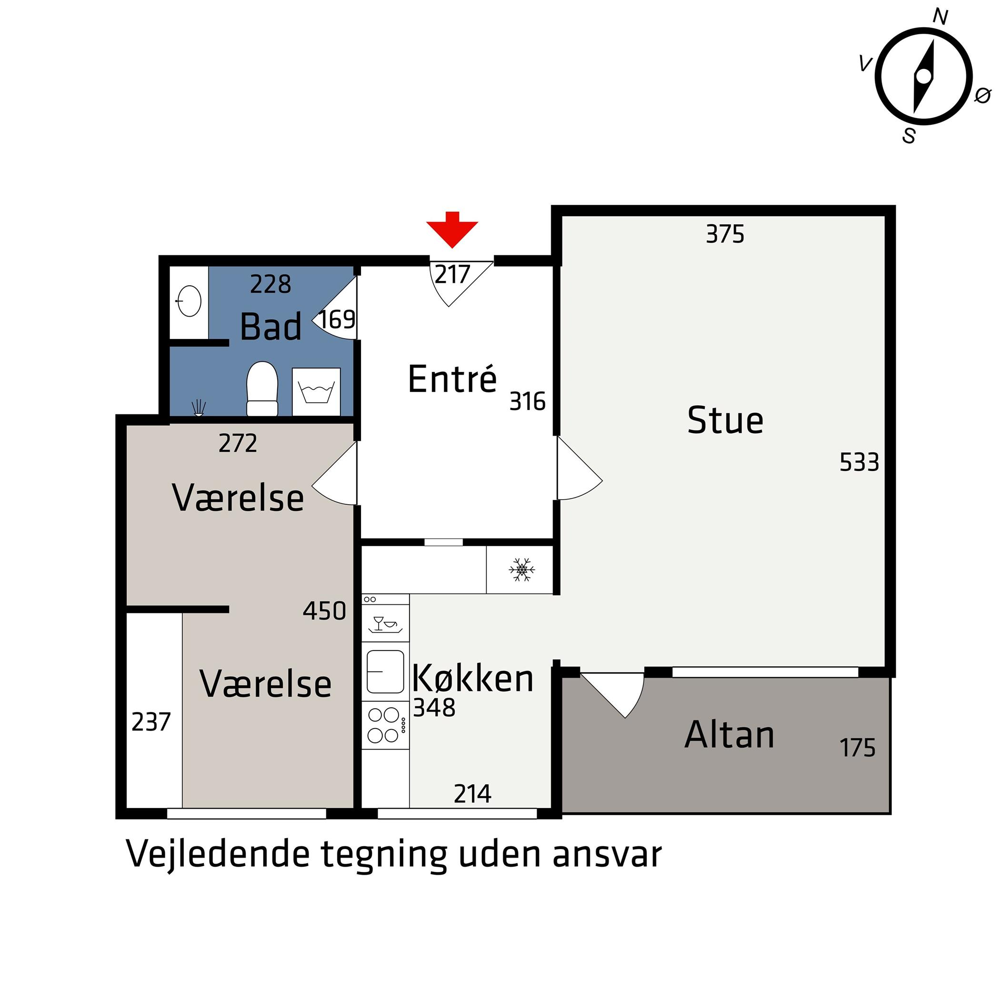

# Vestervang 34, 1 mf
[[§Reno Vestervang 34: Generelt]]

*Status*
* Købsaftale
	* Jurist
	* Bank
	* Sælger

* Høre min advokat om nedslagets størrelse. Sende ham mail fra Købers Mægler, som er “aftaleindgåelsen”. 
	* Vil han også mene, at nedslaget er 60.000, fordi opslagsprisen nu er 1.998.000?
 

*Dokumentation*
* [[Standardspørgsmål til boligkøb]]
[file:A32C8EFA-40A2-4344-9034-FBACA7AE5A72-96740-000002F6816B1659/Salgsopstilling Vestervang 34 1. mf.pdf]
* [Vestervang 34, 1 mf, 8000 Aarhus C | Ejendomme | 001457 | Nybolig Ejendomsmægler](https://www.nybolig.dk/ejerlejlighed/8000/vestervang/102885/001457)

*Forbedringsmuligheder*

[[Reno Vestervang: Badeværelse (15,5)]]
[[Reno Vestervang: Køkken (14.500)]]
[[Reno Vestervang: Soveværelse]]
[[Reno Vestervang: Stue]]
[[Reno Vestervang: Altan]]
[[Reno Vestervang: Entre]]

[[Udstyr til håndværk]]

* Vådrumssikring - hvis væggene er lavet af beton er der ikke krav til vådrumssikring.
	* "Hvis betonen er mindst 6 cm tyk, styrkeklassen er 20, og væggen er armeret"

* Hvorfor hegn på altanen?

* Hvem har lavet køkkenet? Findes modellen stadig på hjemmesiden?

* Hvordan står det til med taget? Er der sparet op i ejerforeningen?

* Elrapport?

* Byggeteknisk rapport?

* Prisoverslag på at betale sig ud af hjemfaldspligten?

* Hvem er naboerne?

* Hvor lang tid har sælger ejet ejendommen?

* Hvorfor sælges? 

* Tilstandsrapport?

* Nogle energioptimeringer der er fundet?

* Begrænsninger i ejerforeningen?
	* Nok noget med facaden, hvad med indvendigt?

* Er der lavet renoveringen? Af hvem?

* Varme/el?

* Nogle ændringer i lokal- eller trafikplanen på vej?

## Backlinks
* [[§Boligkøb - køb af lejlighed, hus]]
	* *Omkostninger*
* [[10-Dec-21 - Work]]
	* A little dubious about whether I'm getting a good price for [[Vestervang 34, 1 mf]]. There has been a sale at the 4th floor in august for 1.9, and if the interior is not terrible, that is a great price compared to this one. 
* [[52-22 - Homely]]
	* Design [[Vestervang 34, 1 mf]]
* [[25-Dec-21 - Homely]]
	* [[Vestervang 34, 1 mf]]
* [[27-Dec-21 - Homely]]
	* Write Astrid (seller) about [[Vestervang 34, 1 mf]]
* [[Dec-21 - Home]]
	* [[Vestervang 34, 1 mf]]

<!-- {BearID:8D633079-F8F6-4B23-BBA9-D089E9FE99FC-14187-000006F05B359585} -->
