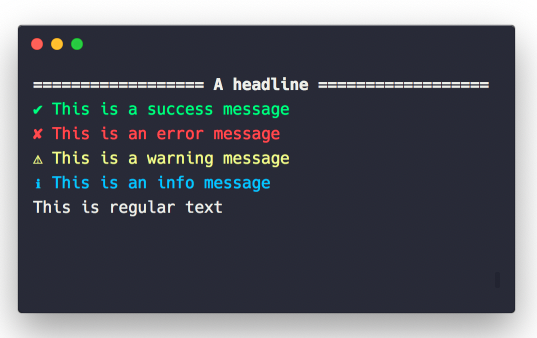

# Wasabi (python)
Q. Which package in python allows you to print messages like this?

A. `wasabi`

```
from wasabi import msg

msg.good("Success!")
msg.info
msg.warn
```

[GitHub - ines/wasabi: 🍣 A lightweight console printing and formatting toolkit](https://github.com/ines/wasabi)

<!-- {BearID:4828E8A6-3116-4B4F-BCC4-CD6C2900DE6F-88388-00000743D8364B8C} -->
