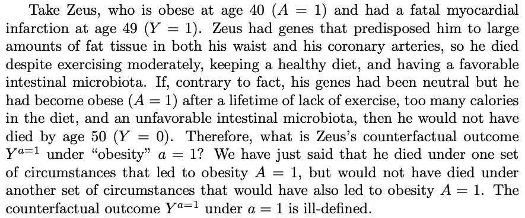

# §Consistency (Causal Inference)

Q. What is meant by the [[§Consistency (Causal Inference)]] assumption?
A. The treatment is the same for all individuals. E.g. if looking at obesity, the way they became obese, their duration etc. is all the same.

Q. For which types of studies is the "consistency" assumption relevant?
A. All studies

[[Hernan – Causal Inference, What If?]]

## Backlinks
* [[§Consistency (Causal Inference)]]
	* Q. What is meant by the [[§Consistency (Causal Inference)]] assumption?

<!-- {BearID:5D5DFC5D-CD5F-4C9D-BF95-2881AAA2CC0A-86616-000002FE1B35009E} -->
