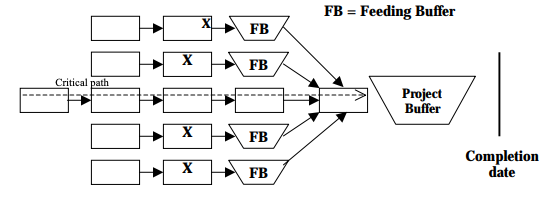
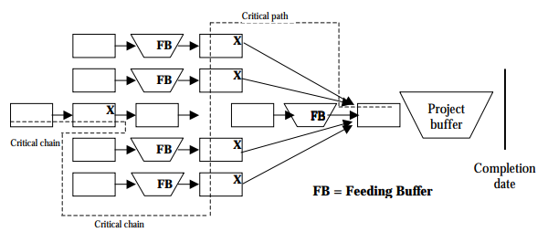

# §Critical Chain
How does this differ from the [[§Critical Path]]?

Q. How does a [[§Critical Path]] differ from a [[§Critical Chain]]?
A. The critical path is the path with the largest amount of work hours. 
The critical chain is the chain of tasks that will take the largest amount of calendar time, given the resource-constraints of the project.

X's are tasks that need to be completed by the same resource

## Backlinks
* [[§Critical Chain]]
	* Q. How does a [[§Critical Path]] differ from a [[§Critical Chain]]?
The critical chain is the chain of tasks that will take the largest amount of calendar time, given the resource-constraints of the project.
* [[§Project Management]]
	* What will others be waiting on me for in the future - [[§Critical Chain]]
	* Work hard when we're on the [[§Critical Chain]]
	* Q. You're collaborating with others, and it appears like you're not making much progress on the [[§Critical Chain]]. Which discipline can help you here?

<!-- {BearID:F16761A1-2382-4039-B2D3-DB5F28355601-8349-00000581A81BCEF7} -->
