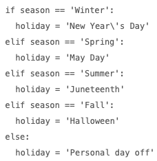

# §Python
[[Python (getting better at)]]
[[Python: Modules]]

[[Python functions]]
[[Python: Terminology]]
[[Python gotchas]]

Q. How do classes relate to objects?
A. Classes are templates for objects

Q. How do you define a class in Python?
A. 
``` py
# Dog class
class Dog:
  # Method of the class
  def bark(self):
    print("Ham-Ham")
```

Q. How do you create an instance of Dog?
```py
# Dog class
class Dog:
  # Method of the class
  def bark(self):
    print("Ham-Ham")
```
A. 
```py
# Create a new instance
charlie = Dog()
```

Q. How do you add a bark method to Dog in python?
```py
# Dog class
class Dog:
  
```
A.
```py
# Dog class
class Dog:
  # Method of the class
  def bark(self):
    print("Ham-Ham")
```

Q. What does `self` refer to in a class?
A. The new instance.

Q. How might you find which iteration a for-loop is at, without using a counter in python?
A. `for i, item in enumerate(container):`

Q. In python, you want to iterate over a list, but also need to know the number of the item you’re at. How might you do this?
A. `for i, item in enumerate(container):`

Q. What is the advantage of using `Counter` in python as compared to a dictionary?
A. Counter can take a list of elements and update counts, e.g. `pos_counts.update([token.tag_ for token in doc])`

Q.  `[new_item.property for old_item in old_list]`. What is this python pattern called?
A. List comprehension.

Q. What does the underscore in `_color` signify in Python?
A. Color is a private attribute

Q. How do we signify a [[Private attribute]] in Python?
A. `_attribute`

Q. You’re writing scaffolding-code for python, and you know you’ll need `myfunc`. How will you represent it temporarily?
A. 
```
def myfunc():
    raise NotImplementedError
```

Q. What is the pythonic way of evaluating if a variable is True?
A. `if var:`

Q. `if var == True:`. Why is this non-pythonic?
A. Can be written more concisely as `if var:`

Q. What does the r in `print(r”Testing, \some\dir”)` mean?
A. The string is “raw”, i.e. characters aren’t escaped

Q. You want to add variables to a string in python. How might you do it?
A. `f’String {var)’`

Q. You want to look for a value in a dict. If the key doesn’t exist, return another value. How might you do this?
A. `dict.get(key, alt_val)`

Q. What does this bit of code do? `dict.get(spam, ham)`
A. Returns value for spam in dict, if it doesn’t exist, returns ham.

Q. How might you rewrite this more concisely in Python?

A.
```
holiday = {
	'Winter': 'New Year\'s Day',
	'Spring': 'May Day', 	'Summer': 'Juneteenth', 	'Fall':'Halloween'
}.get(season, 'Personal day off')
```

Q. How might you rewrite this bit of code:
```
if spam == “cat” or spam == “dog” or spam == “moose”:
```
A. 
```
if spam in (“cat”, “dog”, “moose”):
```

Q. What is the purpose of an `if __name__ == "__main__":` statement?
A. Only run the below code if the script is not imported

Q. Consider `import fibo`. Where does Python look for `fibo.py`?
A. 1) The present *working* directory, 2) `PYTHONPATH`

Q. What is the working directory when writing a package in python?
A. The top-level directory

## Backlinks
* [[§Programming]]
	* [[§Python]]

<!-- #anki/deck/Programming #anki/tag/Python -->

<!-- {BearID:311BD76A-0A9F-4D13-B5AC-8E2429A6922F-1199-0000009BD7E84748} -->
